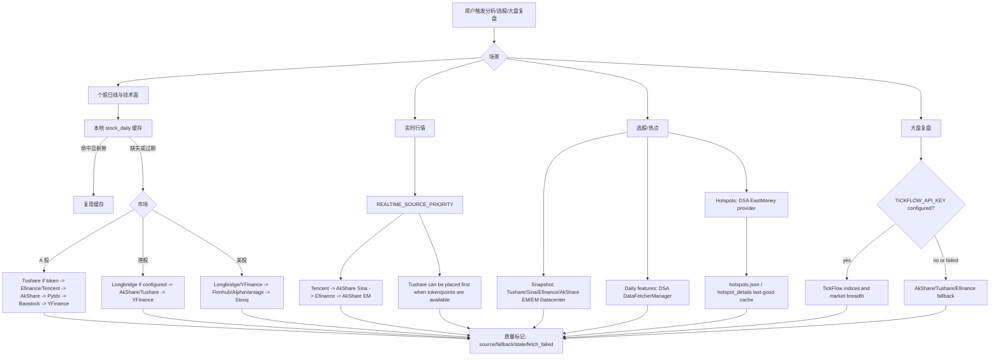
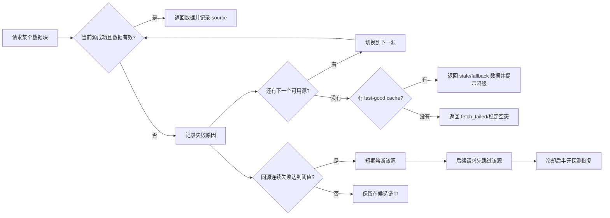
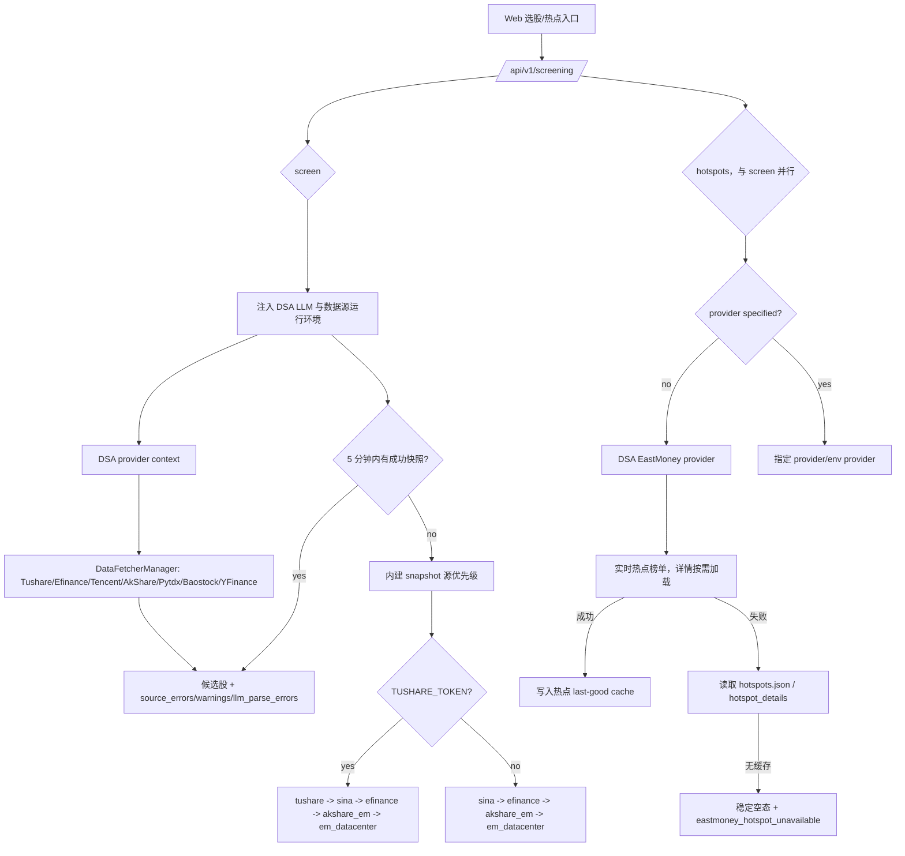

# 数据源稳定性与故障处理图示

本文面向用户、部署者和维护者，说明 DSA 已接入的数据源如何参与分析、选股和大盘复盘，以及当数据源失败时系统会怎么降级。

核心原则：先用项目已经接入并验证过的数据源，把失败路径讲清楚；新增外部数据源应放在第二阶段，避免先扩大维护面。

## 一句话答复用户

如果遇到“数据源失败”，通常不是系统只能用一个源，而是免费源被限流、上游接口临时变更、网络抖动或当前市场/标的不支持。DSA 已经内置多数据源 fallback，会按场景自动尝试下一个源；如果你希望更稳定，建议至少配置一个 token 型稳定源：

- A 股个股与选股：优先配置 `TUSHARE_TOKEN`，并保留 AkShare / Efinance / Tencent / Baostock / YFinance 兜底。
- A 股大盘复盘：配置 `TICKFLOW_API_KEY` 后，指数和市场宽度会优先尝试 TickFlow，失败后回退现有免费源。
- 港股 / 美股：配置 `LONGBRIDGE_*` 后优先使用 Longbridge，YFinance、Finnhub、AlphaVantage 继续兜底。
- 热点题材：选股的热点实现参考 AlphaSift，默认走 EastMoney provider，并使用本地 last-good cache 降低实时接口失败影响。

## 已接入数据源矩阵

| 场景 | 已接入源 | 默认使用方式 | 失败处理 |
| --- | --- | --- | --- |
| A 股日线 / 技术面 | Promax、Efinance、Tencent、AkShare、Tushare、Pytdx、Baostock、YFinance | `DataFetcherManager` 按优先级尝试；配置 `PROMAX_API_KEY` 后 Promax 以 `-2` 居首，配置 `TUSHARE_TOKEN` 后 Tushare 以 `-1` 次之 | 单源失败后尝试下一个源；连续失败会短期熔断该源 |
| A 股实时行情 | Promax、Tencent、AkShare Sina、Efinance、AkShare EM、Tushare | `REALTIME_SOURCE_PRIORITY` 控制顺序；未显式配置时，检测到 `PROMAX_API_KEY` / `TUSHARE_TOKEN` 会自动前插 `promax` / `tushare` | 失败源记录 `fallback_from`，成功源继续返回 |
| A 股大盘复盘 | TickFlow、AkShare、Tushare、Efinance | 配置 `TICKFLOW_API_KEY` 后，主指数和市场宽度优先尝试 TickFlow | TickFlow 权限不足或失败时回退 AkShare / Tushare / Efinance 链路 |
| A 股大盘复盘新闻 | 财联社电报（AkShare `stock_info_global_cls`，零 Key）+ 已配置的搜索引擎（Tavily/SerpAPI/Bocha/Anspire/MiniMax/Brave/SearXNG） | 仅 `region=cn` 启用；财联社电报作为补充追加到搜索结果里，不替代通用搜索 | 财联社失败或返回空不影响已有搜索结果；未配置任何搜索引擎时财联社电报仍可独立提供基础新闻，不再是"没配搜索 Key 就完全没有市场新闻" |
| 选股快照 | Tushare、Sina、Efinance、AkShare EM、EastMoney Datacenter | 有 `TUSHARE_TOKEN` 时自动把 `tushare` 放入快照优先级；否则使用免费源链路 | 选股引擎维护 source health；状态接口透出 snapshot/daily health |
| 选股日线补特征 | `DataFetcherManager` | 选股引擎优先复用现有日线与缓存链路 | 现有链路失败后才回到引擎自身的日线源 |
| 选股热点题材 | EastMoney provider、参考 AlphaSift 的 hotspot 实现、last-good cache | 未指定 provider 时默认使用 EastMoney provider | 实时失败时回退热点缓存；无缓存时返回稳定空态和可读错误 |
| 港股 | Promax、Longbridge、YFinance、AkShare、Tushare | Promax 覆盖港股日线（`hk_daily`），配置后优先于其他源 | 网关抖动时回退 Longbridge / YFinance / AkShare |
| 美股 | Longbridge、YFinance、Finnhub、AlphaVantage、Stooq | **Promax 不参与美股**：`us_daily` 传日期区间会触发网关 5xx，实时行情也不覆盖美股，已在 `_DAILY_MARKET_FETCHER_SUPPORT` 中限定为 `{cn, hk}` | Longbridge 冷却或失败时回退 YFinance / 其他可用源 |

## 总体链路图



## 失败与降级图



当前日线源熔断策略为连续失败 3 次后短期冷却约 5 分钟。它的目的不是永久禁用数据源，而是避免一个短时间不可用的源拖慢整批分析。

## 选股与热点链路



## 推荐配置档

### 免费模式

适合个人试用，依赖免费源自动 fallback。优点是不需要 token；缺点是更容易遇到上游限流或临时接口变化。

```env
REALTIME_SOURCE_PRIORITY=tencent,akshare_sina,efinance,akshare_em
ENABLE_EASTMONEY_PATCH=true
```

### Promax 网关模式（A 股 / 港股优先）

适合希望用单一聚合网关覆盖 A 股与港股主链路的场景。Promax 聚合 Tushare Pro 多类接口，
响应体与 Tushare 官方完全一致，配置后以优先级 `-2` 排在所有数据源之前；
免费源与 Tushare 官方继续作为兜底，网关抖动时自动回落。

```env
PROMAX_API_KEY=your_promax_key
# 以下均为可选，留空使用默认值
# PROMAX_BASE_URL=https://pcd.mobcvb.cn/tushare/pro
# PROMAX_PRIORITY=-2
# PROMAX_VERIFY_SSL=false      # 默认关闭校验；实测网关证书可信，建议改 true
# PROMAX_MAX_RETRIES=2         # 瞬时读超时 / 5xx 的重试次数
```

注意事项：

- **美股不走此源。** 网关 `us_daily` 传 `start_date` / `end_date` 会稳定返回 5xx，
  实时行情接口也不覆盖美股，因此美股仍由 YFinance / Finnhub / Longbridge 提供。
- **网关存在瞬时抖动。** 实测存在偶发读超时与 5xx，客户端内置有限重试
  （轻量接口默认 3 次，线性退避）；全市场重型调用则不重试、超时即让位，避免
  重试把一次失败放大成分钟级阻塞。重试耗尽后交由 `DataFetcherManager` 回落下游源。
- **默认关闭 TLS 证书校验。** 这会让 `X-API-Key` 与行情数据面临中间人风险；
  实测网关证书可信，可设 `PROMAX_VERIFY_SSL=true` 开启校验。
- Promax 使用独立的熔断家族 `promax`，不与 Tushare 官方共享熔断状态。

### A 股稳定模式

适合经常跑选股、批量分析或对外服务。Tushare 用于增强 A 股日线与快照稳定性；TickFlow 可增强 A 股日 K、实时行情和大盘复盘（实时行情需显式加入 `REALTIME_SOURCE_PRIORITY`）；免费源继续作为兜底。

```env
TUSHARE_TOKEN=your_tushare_token
TICKFLOW_API_KEY=your_tickflow_key

REALTIME_SOURCE_PRIORITY=tickflow,tushare,tencent,akshare_sina,efinance,akshare_em
SNAPSHOT_SOURCE_PRIORITY=tushare,sina,efinance,akshare_em,em_datacenter

# 选股运行期默认值；显式配置时会保留你的值
DAILY_FETCH_RETRIES=3
DAILY_FETCH_MAX_WORKERS=1
```

注意：TickFlow 能力按套餐权限分层；权限不足或请求失败时会 fail-open 回退到现有免费源，不建议把它当成所有市场行情的唯一来源。

### 港股 / 美股稳定模式

适合港美股组合、持仓和个股分析。Longbridge 配置后优先参与港美股链路；YFinance、Finnhub、AlphaVantage 作为兜底。

```env
LONGBRIDGE_OAUTH_CLIENT_ID=your_client_id
LONGBRIDGE_OAUTH_TOKEN_CACHE_B64=your_token_cache_base64

FINNHUB_API_KEY=your_finnhub_key
ALPHAVANTAGE_API_KEY=your_alphavantage_key
```

如果仍使用 Legacy Longbridge 凭证，也可以继续配置：

```env
LONGBRIDGE_APP_KEY=your_app_key
LONGBRIDGE_APP_SECRET=your_app_secret
LONGBRIDGE_ACCESS_TOKEN=your_access_token
```

## 用户可见提示建议

对外沟通时建议区分三类情况：

| 情况 | 建议提示 |
| --- | --- |
| 单个源失败但 fallback 成功 | 本次使用了降级数据源，分析仍可继续；报告中会标记实际成功源。 |
| 多个源失败但有缓存 | 实时源不可用，本次使用上一次成功缓存；结论会降低置信度。 |
| 全部源失败且无缓存 | 当前数据不可用，请稍后重试，或配置 Tushare / TickFlow / Longbridge 等 token 型数据源。 |

## 后续可做的产品化增强

1. 数据源 Doctor 页面：展示每个源最近成功时间、失败原因、熔断状态和下一次恢复探测时间。
2. 一键推荐配置：根据市场选择生成 `.env` 片段，例如“A 股稳定模式”“港美股稳定模式”“免费模式”。
3. 选股状态面板：直接展示 snapshot/daily source health，让用户知道是 Sina、Efinance、AkShare 还是 Tushare 出问题。
4. 批量任务限速策略：对免费源自动降低并发，优先复用本地日线缓存，减少触发上游限流。
5. 可选商业源接入：只有在现有 Tushare / TickFlow / Longbridge / Finnhub / AlphaVantage 仍不能覆盖需求时，再考虑新增 Twelve Data、Massive/Polygon、Nasdaq Data Link 等源。

## 官方资料

- Tushare: https://tushare.pro/document/2
- TickFlow: https://tickflow.org/
- AkShare: https://akshare.akfamily.xyz/
- Longbridge OpenAPI: https://open.longportapp.com/
- Finnhub API: https://finnhub.io/docs/api
- Alpha Vantage API: https://www.alphavantage.co/documentation/
