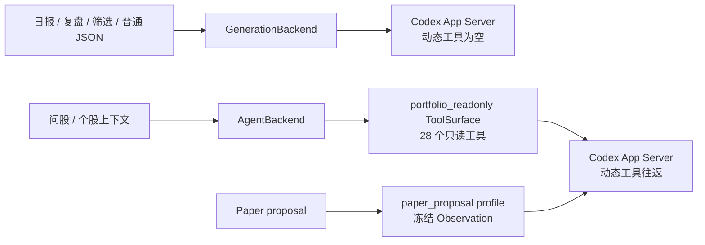

# DSA × Vibe-Trading 用户验收问题修复报告

**日期：** 2026-08-16  
**范围：** 用户提供的 4 张界面截图、回测日志、影子研究日志，以及
`.kiro/specs/dsa-vibe-integration/{design,requirements,tasks}.md`、
`.kiro/specs/codex-unified-generation/`、ADR-0006 和现有实现。

## 结论摘要

本轮已完成代码级修复。Codex 普通 Generation 与 Codex Agent 现在是两个清晰的
能力契约：普通 Generation 可以使用 ChatGPT 订阅额度生成日报/JSON，但故意不获
得工具；Agent Chat 使用 DSA 注册的 `portfolio_readonly` ToolSurface，现有 28 个
只读工具均可向 Codex 暴露。普通问股 Chat 不开放 Paper/真实交易写入、Shell、文件、
MCP 和插件；Paper 决策周期另用冻结的 `paper_proposal` profile 生成结构化 Proposal，
仍需人工审批。

真实 OAuth、真实模型、在线数据源、微信扫码、CI 和生产部署没有在离线测试中执行，
见文末的外部验收清单。

## 1. Codex 能力边界与“没有工具”的含义

ADR-0006 明确保留 `GenerationBackend` 与 `AgentBackend` 两个接口；官方 App Server
协议说明见 [Codex App Server 文档](https://developers.openai.com/codex/app-server/)：



- `GENERATION_BACKEND=codex_app_server`：使用官方 `codex app-server --stdio` 的隔离
  session，生成普通文本/严格 JSON。它不会直接读取 DSA 行情、报告、网络、MCP、Apps
  或 Plugins；行情和报告上下文仍由 DSA 分析流水线先准备后注入。这是最小权限设计，
  不是 Codex 协议不能调用工具。
- `AGENT_BACKEND=codex_app_server`：使用同一官方 App Server 和 OAuth 登录态，但
  DSA 会注册动态 ToolSurface。当前 profile 可调用实时行情、历史、筹码、资金流、
  技术指标、新闻/综合情报、指数/板块、基本面/公告/研报、回测汇总与个股明细、
  持仓快照、风险和公司行动等 28 个只读工具。
- 工具是否可调用由 DSA 的 Execution Profile、scope、deadline 和取消安全策略共同
  决定；Codex 账号登录本身不会自动授予业务工具权限。
- Paper Account 不把审批/建单写入工具混入普通问股面；Paper controller 使用冻结
  Observation 和独立 `paper_proposal` profile，输出 Proposal 后仍由 Paper 工作台人工
  approve/reject。

因此“普通 Generation 无工具”不等于“问股 Agent 无工具”。若希望日报也走 Codex，
需要设置 `GENERATION_BACKEND=codex_app_server`；若希望问股走 Codex 工具，则还需
设置 `AGENT_BACKEND=codex_app_server`。两者都使用 Codex 订阅时同时设置两个变量。

## 2. 逐条问题与修复

| # | 根因 | 已实施修复/当前行为 |
|---|---|---|
| 1/2 | Agent 旧提示词把能力描述成“只能读已保存上下文”；3 个只读工具因 cancellation-safe 过滤被隐藏；setup check 误读旧的 `AGENT_GENERATION_BACKEND`；6 位代码正则排除了 ETF `159202`。 | `search_comprehensive_intel`、`get_sector_rankings`、`get_stock_backtest_summary` 补齐取消检查并开放到 Codex；Agent prompt/UI 改为真实只读能力；setup check 按显式 `AGENT_BACKEND`、`AGENT_MODE`、单 Agent、超时和 `codex` 可执行文件判断；股票作用域接受完整六位代码；事件显示名覆盖 28 个工具。 |
| 4（补充） | 统一 Codex 预设会打开 `AGENT_MODE=true`；普通个股/ETF 分析因此误进入旧的 LiteLLM Agent pipeline，在仅登录 Codex 时返回 `No LLM configured ... before using Agent`。 | `src/core/pipeline.py` 在显式 `AGENT_BACKEND=codex_app_server` 时禁止 legacy stock-analysis Agent 分支，普通报告继续走 `GENERATION_BACKEND`；LiteLLM Agent 的显式配置仍保持兼容。 |
| 3/7 | Paper 页面把示例代码误当成运行时输入，输入事件容易触发行情请求。 | Paper symbol 默认空；留空不请求行情、标注或 SSE；只有显式点击“读取行情”才请求，URL 明确带 `?symbol=` 时才预加载；输入提示保留 `600519 / AAPL` 作为示例，不是默认值。 |
| 4 | 企业微信机器人 webhook 与个人微信 iLink 是两种协议；iLink token 不应进入普通设置表单。 | 设置→通知渠道新增个人微信安全状态卡片和刷新接口，只显示 enabled、URL/token ref/凭据/allowlist 是否配置和就绪原因，不返回 token、不提供误导性的 token 编辑框。iLink 仍由进程启动配置、凭据存储和本人 allowlist 控制；企业微信 webhook 仍是主动通知渠道。 |
| 5 | `/backtest/performance` 查询的是已持久化的整体汇总；首次没有汇总时返回 404；`/results` 返回 200 代表结果列表接口正常。 | 保留 404 的“暂无汇总”语义，前端将其转换为 `null` 并显示无指标空状态，不把空汇总伪造成成功。执行一次有效回测并保存结果后，整体汇总才会出现。 |
| 6 | 影子研究每次按输入变化请求；代码长度不足时也发出 `0/00/002...` 查询；默认日期未传入统一 Market Data；日期窗口曾被路由器压成 `YYYYMMDD`，Baostock/YFinance 等适配器拒绝；Pytdx 不可达时约 30 秒重试；前端用 snake_case 读取 camelCase 响应。 | 信号查询增加 300ms debounce 且至少 4 位代码；回测/扫描传入 `market_data_start/end`，留空观测时按日期范围逐日重算指标；DataFetcherManager 统一向适配器传递 ISO `YYYY-MM-DD`；默认数据源顺序移除 Pytdx，单源超时默认 15 秒（AkShare 约 10 秒回退可完成），仍可用环境变量显式加入；修正 OOS/样本/收益指标字段映射。旧的 degraded run 不会自动改写，需按新日期范围重新回测。 |
| 8 | ETF 自动补全依赖本地索引，索引可能没有最新 ETF；各 provider 的沪市 ETF 前缀也不完整。 | 统一 ETF 识别补充 `50` 前缀；Tushare 刷新脚本默认同时执行 `--a-rk --etf`；生成索引时保留 ETF 类型。已有静态索引不会凭空生成新证券，需配置 `TUSHARE_TOKEN` 后运行 `python scripts/refresh_stock_index.py`；直接输入完整六位 ETF 代码不依赖补全索引。 |
| 9 | Codex/数据源是有界但可能较慢的外部调用；无界重试会放大延迟和费用。 | Generation/App Server 有默认超时、输出上限和并发上限；Agent 有整体时限、停止/取消清理；前端保持异步任务、停止、重试和明确错误状态；Codex 默认不静默回退 LiteLLM，只有显式配置 fallback 才允许。影子研究单独使用有界数据源策略，避免 Pytdx 长时间阻塞；普通分析启用 Codex Agent 预设时不会再误走 LiteLLM。 |

## 3. 微信接入方式

当前实现不是“把个人微信当作一个 webhook URL”：

1. `WECHAT_CHANNEL_ENABLED=true` 后，DSA 进程启动 `ConversationChannelRuntime`。
2. `WECHAT_ILINK_BASE_URL`、`WECHAT_ILINK_TOKEN_REF` 和 `WECHAT_ALLOWLIST` 来自进程
   环境；token 本体通过 macOS Keychain 或 `~/.dsa/credentials.json`（权限 0600）
   读取。
3. iLink adapter 使用长轮询、cursor、重连/退避和会话去重，把本人一对一文本消息
   转成现有 `CommandDispatcher`；空 allowlist 是 deny-all。
4. Web 设置页只读展示配对状态，避免把 token/扫码流程放进通用配置 API。主动告警
   仍走企业微信 webhook、飞书、钉钉、PushPlus 等 Notification adapter。

本地/服务器 `.env` 只放引用，不放 token：

```dotenv
WECHAT_CHANNEL_ENABLED=false
WECHAT_ILINK_BASE_URL=https://<your-ilink-endpoint>
WECHAT_ILINK_TOKEN_REF=wechat-ilink-token
WECHAT_ALLOWLIST=<your-openid-or-user-id>
WECHAT_POLL_TIMEOUT_MS=30000
```

## 4. 影子研究与回测的正确操作

影子回测现在有两条输入路径：

- **推荐**：代码、样本外起点、历史起止日期，观测 JSON 留空。后端从统一
  `DataFetcherManager.fetch(DataQuery("daily_data", ...), SourcePolicy)` 获取日线，
  在每个交易日只使用当日可见数据计算指标，并保存 source snapshot hash。
- **复盘**：提供已经冻结的观测 JSON。后端不会再次抓行情，但仍校验 cutoff、规则
  和样本外完整性。

对 `600519` 的推荐首次参数是：历史起点 `2024-01-01`、样本外起点 `2025-01-01`、
历史终点取当前交易日前最后一个有效日期；执行回测成功后再批准 profile。若上游只返
回两条以内、没有样本外行或没有可执行收益，状态仍应为 `degraded`，这是 fail-closed
行为而不是把不足数据包装为策略成功。

## 5. 关键改动文件

- Agent/工具：`src/agent/codex_agent_backend.py`、`src/agent/codex_app_server_transport.py`、
  `src/agent/executor.py`、`src/agent/tools/{search_tools,market_tools,backtest_tools}.py`、
  `src/agent/stock_scope.py`、`api/v1/endpoints/agent.py`。
- 配置/状态：`src/services/system_config_service.py`、
  `src/services/agent_backend_status_service.py`、`api/v1/endpoints/system_config.py`、
  `api/v1/schemas/system_config.py`。
- Paper/Shadow：`apps/dsa-web/src/pages/PaperWorkbenchPage.tsx`、
  `apps/dsa-web/src/pages/ShadowResearchPage.tsx`、`src/shadow_research/{service,snapshot}.py`、
  `api/v1/{endpoints,schemas}/shadow.py`。
- ETF/数据：`data_provider/{security_id,base,akshare_fetcher,baostock_fetcher,efinance_fetcher,tushare_fetcher,yfinance_fetcher}.py`、
  `scripts/{fetch_tushare_stock_list,generate_index_from_csv,refresh_stock_index}.py`。
- 微信/UI：`apps/dsa-web/src/components/settings/WeChatChannelStatusPanel.tsx`、
  `apps/dsa-web/src/api/systemConfig.ts`、`apps/dsa-web/src/types/systemConfig.ts`、
  `apps/dsa-web/src/i18n/uiText.ts`。

## 6. 验证记录

- 后端定向 Agent/ToolSurface/Profile/System Config：**85 passed**。
- 前端问股、Paper、Shadow、Settings、Codex 状态和 API 定向回归：**173 passed**；全量
  Vitest 单进程回归：**1120 passed, 2 skipped**；`npm run lint` 和 `npm run build`
  通过。
- 全量后端回归：**6087 passed, 5 skipped, 49 warnings**（6092 项收集）；唯一跳过项
  属于既有网络/loopback 限制，没有失败。
- `.venv/bin/python -m compileall`（本轮改动模块）和 `git diff --check` 通过。

## 7. 仍需在真实环境执行的外部验收

这些步骤不能用离线 fake 测试替代：

1. 在运行 DSA 的同一用户下执行 `command -v codex`、`codex --version`，完成官方
   OAuth/ChatGPT 登录；在设置页刷新账号和协议状态。
2. 显式执行一次 Generation text/JSON smoke 和一次 Agent 问股，确认日报、`159202`
   或其他 ETF 的实时工具、新闻和回测工具有真实返回；确认失败时没有隐式 LiteLLM
   费用。
3. 配置真实在线数据源，运行影子回测并检查 `source`、`as_of`、stale/limitations 和
   OOS 样本数；网络不稳定时确认 fallback 日志和超时。
4. 用 fake/真实 iLink 完成扫码、allowlist、长轮询、重连、过期和停用验收；再用企业
   微信 webhook 做一次主动通知测试。
5. 在 CI/发布镜像补跑 `flake8`、前端 gate、Docker build/GitHub Actions；服务器上
   另外验证 systemd、健康检查、日志、Caddy/TLS 和重启后的 Codex 登录态。

本报告不把“可以尝试”状态当作真实模型成功，也不把一次 `/results` 200 或一次健康
检查当作完整业务验收。
